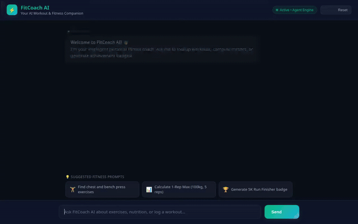

# 🏋️ FitCoach AI — AI Workout & Fitness Coach Agent

FitCoach AI is an intelligent fitness coaching agent built with the **Google Agent Development Kit (ADK)**, **Gemini 2.5 Flash**, **Vertex AI**, and **Adaptive UI (A2UI)**. It acts as a personal fitness coach that remembers your workout preferences, tracks lifting progress, logs sessions into Google Cloud Firestore, calculates 1-Rep Max metrics, queries public exercise databases, generates custom achievement badge graphics, and creates exercise demonstration videos.



> **🎬 Full Video Demo with Audio**: Watch or download the full HD demo recording featuring instrumental lo-fi AI background music (generated via Google Vertex AI Lyria): **[`fitcoach_agent_demo.mp4`](fitcoach_agent_demo.mp4)**.

---

## ✨ Implemented Capabilities & Features

All capabilities listed below are fully implemented in code in `app/` and configured in `agents-cli-manifest.yaml`:

- **🤖 ADK Agent & Turn-by-Turn Memory Bank**:
  - Powered by `google.adk.agents.Agent` with `gemini-2.5-flash`.
  - Automatic memory extraction and storage via `add_session_to_memory` callback to remember user preferences, physical limitations, equipment, and goals across sessions.

- **🎨 Adaptive UI (A2UI 0.8 Integration)**:
  - Generates rich, structured UI cards rendered dynamically on supported frontends.
  - Implements `A2uiSchemaManager` (v0.8) and `BasicCatalog` paired with an `after_model_callback` (`a2ui_callback`) in `app/a2ui_utils.py`.

- **🗄️ Firestore Workout Logging & History**:
  - Stores and retrieves workout sessions (`log_workout_session`, `get_workout_history`, `get_workout_session_details`) using **Google Cloud Firestore**.

- **🧮 Fitness & 1RM Calculator**:
  - Custom calculation tool (`calculate_fitness_metrics`) computing 1-Rep Max (Epley formula), total weight volume, and target repetition ranges for strength goals.

- **🏋️ Exercise Database Search**:
  - Integrates with public exercise APIs (`fetch_exercise_info`) to query exercise instructions, target muscle groups, and required equipment.

- **🏆 Achievement Badge Image Generation (Imagen 3)**:
  - Uses **Vertex AI Imagen 3** (`imagen-3.0-generate-002`) in `generate_workout_badge_image` to create custom workout badge graphics.
  - Saves generated images to ADK session artifacts and uploads them to Google Cloud Storage.

- **🎥 Exercise Demo Video Generation (Google Omni Model)**:
  - Uses Google's **Omni model** (`gemini-omni-flash-preview`) in the `global` region via the Vertex AI Interactions API in `generate_exercise_demo_video` to generate short exercise demonstration motion videos.
  - Saves MP4 bytes to ADK session artifacts and uploads them directly to Google Cloud Storage.

- **☁️ Cloud Storage Media Hosting**:
  - Uploads generated images and videos to a public Google Cloud Storage bucket (`fitcoach-ai-media-qwiklabs-gcp-02-38ad309f606a`) and returns public HTTPS URLs for inline display in A2UI cards.

- **🐍 Secure Code Execution**:
  - Leverages `AgentEngineSandboxCodeExecutor` for executing Python code in an isolated sandbox for advanced fitness data analysis.

- **💻 Rebranded Web Frontend**:
  - FastAPI proxy backend (`frontend/main.py`) paired with a custom dark-themed chat interface (`frontend/static/index.html`) featuring prompt quick-action pills, typing animations, copy buttons, and real-time A2UI card rendering.

### 📋 Planned / Future Enhancements
- **Wearable Sensor Telemetry Integration**: Real-time heart rate and smartwatch telemetry ingest (planned, not yet implemented).

---

## 🛠️ Repository Architecture & File Structure

```
fitcoach-ai/
├── app/
│   ├── agent.py                 # Core ADK root_agent, prompt instructions & callbacks
│   ├── a2ui_utils.py            # A2UI v0.8 schema extraction and callback logic
│   └── tools/
│       ├── exercise_api_tools.py # wger.de public exercise database search
│       ├── fitness_calculator.py # 1RM & volume calculation tool
│       ├── image_gen_tools.py   # Imagen 3 workout badge generation
│       ├── video_gen_tools.py   # Gemini Omni exercise video generation
│       └── workout_db_tools.py   # Firestore session logging & history tools
├── frontend/
│   ├── main.py                  # FastAPI proxy backend connecting frontend to agent
│   ├── static/
│   │   └── index.html           # FitCoach AI web UI with A2UI support
│   └── Dockerfile               # Cloud Run deployment configuration
├── agents-cli-manifest.yaml     # ADK agent manifest configuration
├── fitcoach_agent_demo.webm     # Recorded Playwright demo video with Lyria music
├── demo.gif                     # Looping demo preview GIF
└── pyproject.toml               # Python project dependencies
```

---

## 🚀 Setup & Local Execution Guide

### Prerequisites
- Python 3.11+
- `uv` package manager (`pip install uv` or `curl -sSf https://astral.sh/uv/install.sh | sh`)
- Google Cloud SDK authenticated (`gcloud auth application-default login`)

### 1. Install Dependencies
```bash
# Install Python dependencies using uv
uv sync

# Install frontend node dependencies
cd frontend && npm install && cd ..
```

### 2. Environment Configuration
Create a `.env` file in the project root:
```env
GOOGLE_CLOUD_PROJECT=your-gcp-project-id
GOOGLE_CLOUD_LOCATION=us-east1
```

### 3. Run the Agent Locally (ADK Playground)
To test the agent interactively via the ADK Playground:
```bash
agents-cli playground
```
This starts the ADK dev UI on port `8000`.

### 4. Run the Custom Web Frontend Locally
To start the custom FitCoach AI web application:
```bash
cd frontend
python main.py
```
Open your browser and navigate to `http://localhost:8080` (or your local server port) to interact with FitCoach AI.

### 5. Running Tests & Evaluations
```bash
# Run unit and integration tests
uv run pytest tests/unit tests/integration

# Run evaluation suite
agents-cli eval generate
agents-cli eval grade
```

---

## ☁️ Deployment

To deploy the agent to Google Cloud Reasoning Engine:
```bash
agents-cli deploy --project your-gcp-project-id
```

To deploy the frontend to Cloud Run:
```bash
gcloud run deploy fitcoach-ai-frontend \
  --source ./frontend \
  --region us-east1 \
  --allow-unauthenticated \
  --set-env-vars AGENT_ENGINE_RESOURCE_NAME="<your-reasoning-engine-resource-name>",AGENT_DIRECTORY="app"
```

---

## 📜 License

Distributed under the Apache 2.0 License. See `LICENSE` for details.
